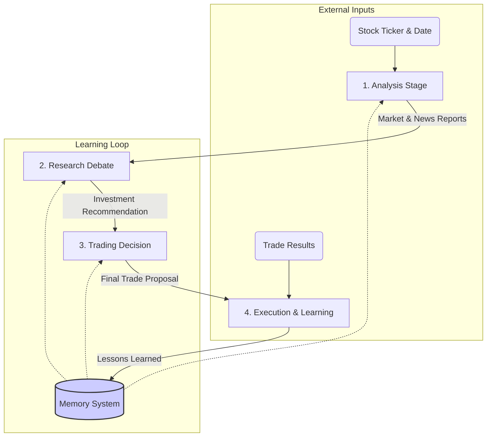

# TradingAgents: Multi-Agent Trading Framework

TradingAgents is a sophisticated multi-agent framework for financial market analysis and trading decisions. The system decomposes complex trading tasks into specialized roles, utilizing collaborative work, debates, and reflection mechanisms to explore more robust and intelligent trading strategies.

## 🚀 Key Features

- **Multi-Agent Architecture**: System includes analysts, researchers, traders, and risk managers, each with specialized roles
- **Debate-Driven Decisions**: Bull vs Bear researcher debates and risk assessment discussions enhance decision robustness
- **Continuous Learning**: Post-trade reflection and memory storage enable continuous improvement and evolution
- **Modular Design**: Highly modular agents and workflows, easy to extend and customize
- **Real-time & Historical Data**: Support for both live market data and cached historical analysis

## 🔄 Workflow Overview

The framework operates through four core stages with a memory-driven learning loop:



## 📦 Installation

### Prerequisites
- Python 3.8+
- Required API keys (see Environment Setup)

### Quick Start
```bash
# Clone the repository
git clone https://github.com/TauricResearch/TradingAgents.git
cd TradingAgents

# Install dependencies
pip install -r requirements.txt

# Set up environment variables (see below)
# Run analysis
python run.py
```

### Environment Setup
Create a `.env` file in the project root with the following API keys:

```bash
# Required APIs
FINNHUB_API_KEY=your_finnhub_key_here
OPENAI_API_KEY=your_openai_key_here

# AWS Bedrock (if using Bedrock models)
AWS_ACCESS_KEY_ID=your_aws_access_key
AWS_SECRET_ACCESS_KEY=your_aws_secret_key

# Optional: Search APIs
TAVILY_API_KEY=your_tavily_key_here
EXA_API_KEY=your_exa_key_here

# Optional: Telemetry tracking
LANGFUSE_PUBLIC_KEY=pk-lf-...
LANGFUSE_SECRET_KEY=sk-lf-...
LANGFUSE_HOST=https://cloud.langfuse.com
```

## 🖥️ Usage Options

### 1. Main Entry Point (Demo Workflow)
```bash
python run.py
```
- Demonstrates complete trading analysis workflow
- Analyzes AMZN stock by default (configurable in code)
- Shows step-by-step progress with detailed output
- Saves all reports and decisions to organized directories

### 2. Simple CLI (Flexible Analysis)
```bash
# Basic usage
python cli_simple.py AAPL

# Advanced usage with options
python cli_simple.py TSLA --date 2024-12-01 --online --provider openai --deep-model gpt-4o
```

**CLI Options:**
- `--date`: Analysis date in YYYY-MM-DD format (default: today)
- `--online`: Use real-time data instead of cached data
- `--provider`: LLM provider - `bedrock` or `openai` (default: bedrock)
- `--deep-model`: Model for complex reasoning tasks
- `--quick-model`: Model for quick analysis tasks

### 3. Python API (Programmatic Usage)
```python
from graph.trading_graph import TradingAgentsGraph
from model_utils import get_model
from default_config import DEFAULT_CONFIG

# Initialize models
llm = get_model(provider="bedrock", model_id="claude-3-sonnet")
quick_llm = get_model(provider="bedrock", model_id="claude-3-haiku", thinking=False)

# Create TradingAgents graph
ta = TradingAgentsGraph(llm=llm, quick_llm=quick_llm)

# Run complete analysis
final_state, decision = ta.propagate("AAPL", "2024-12-01")
print(decision)
```

**Custom Configuration:**
```python
from graph.trading_graph import TradingAgentsGraph
from default_config import DEFAULT_CONFIG
from model_utils import get_model

# Create custom config
config = DEFAULT_CONFIG.copy()
config["max_debate_rounds"] = 3  # Increase debate rounds
config["online_tools"] = True    # Use real-time data

# Initialize models with custom settings
llm = get_model(provider="openai", model_id="gpt-4o")
quick_llm = get_model(provider="openai", model_id="gpt-4o-mini", thinking=False)

# Initialize with custom config
ta = TradingAgentsGraph(llm=llm, quick_llm=quick_llm, online=True, config=config)

# Run analysis
final_state, decision = ta.propagate("NVDA", "2024-12-01")
```

## 🏗️ Project Structure

```
TradingAgents/
├── 🚀 run.py                   # Main entry point with demo workflow
├── 💻 cli_simple.py           # Simple command-line interface
├── ⚙️  default_config.py       # Configuration with detailed comments
├── 🤖 model_utils.py          # Model utilities and file I/O
├── 📦 requirements.txt        # All project dependencies
├── 🤝 agents/                 # Trading agents with comprehensive docs
│   ├── market_analyst.py      # Technical analysis and market trends
│   ├── news_analyst.py        # News and macroeconomic analysis
│   ├── bull_researcher.py     # Bullish investment advocacy
│   ├── bear_researcher.py     # Risk-focused analysis
│   ├── research_manager.py    # Debate coordination and synthesis
│   ├── trader.py              # Final trading decisions
│   └── conversation_swarm.py  # Multi-agent debate orchestration
├── 🛠️  tools/                  # Tools and utilities
│   ├── toolkit.py             # Data fetching and analysis tools
│   └── memory.py              # Agent memory and learning system
├── 📊 dataflows/              # Data processing and API interfaces
├── 🕸️  graph/                  # Main workflow orchestrator
│   └── trading_graph.py       # TradingAgentsGraph main class
└── 🎨 assets/                 # Documentation images and resources
```

## 🤖 Agent Roles

### Analysis Team
- **Market Analyst**: Analyzes technical indicators, price movements, and market trends
- **News Analyst**: Processes news events, macroeconomic data, and market sentiment

### Research Team  
- **Bull Researcher**: Advocates for positive investment positions with growth-focused analysis
- **Bear Researcher**: Provides risk-focused analysis and cautious investment perspectives
- **Research Manager**: Coordinates debates and synthesizes team recommendations

### Trading Team
- **Trader**: Makes final trading decisions with risk management and execution planning

### Support Systems
- **Conversation Swarm**: Manages multi-agent debates with competitive/collaborative modes
- **Memory System**: Stores and retrieves lessons learned from past trading decisions

## 📊 Output and Results

All analysis results are automatically saved to the `results/` directory:

```
results/
└── TICKER_DATE/
    ├── market_report.txt       # Technical analysis results
    ├── news_report.txt         # News and sentiment analysis
    ├── bull_history.txt        # Bull researcher arguments
    ├── bear_history.txt        # Bear researcher arguments
    ├── investment_plan.txt     # Research team recommendation
    └── trader_decision.txt     # Final trading decision
```

## 🔧 Configuration Options

The `default_config.py` file contains comprehensive configuration options:

- **LLM Settings**: Provider, model IDs, thinking modes
- **Debate Parameters**: Number of rounds, discussion depth
- **Data Sources**: Online vs cached data, API configurations
- **Memory Settings**: ChromaDB paths, embedding models
- **Output Settings**: Results directories, file formats

## 🧪 Testing and Validation

To verify the installation and setup:

```bash
# Test basic functionality
python -c "from default_config import DEFAULT_CONFIG; print('✅ Configuration loaded')"

# Test model initialization
python -c "from model_utils import get_model; print('✅ Model utils working')"

# Test agent imports
python -c "from agents import create_market_analyst; print('✅ Agents imported')"

# Run a quick analysis
python cli_simple.py SPY --date 2024-12-01
```

## 📚 Documentation

- **REFACTORING_SUMMARY.md**: Detailed documentation of recent code reorganization
- **PROJECT_STATUS.md**: Current project status and quality assurance
- **Code Comments**: Comprehensive English documentation throughout the codebase
- **Docstrings**: Detailed function and class documentation

## 🤝 Contributing

We welcome contributions! The codebase is well-organized with:
- Clear separation of concerns between agents, tools, and workflows
- Comprehensive documentation and comments
- Modular design for easy extension
- Multiple entry points for different use cases

## ⚠️ Disclaimer

TradingAgents is designed for research and educational purposes. Trading performance may vary based on many factors including model selection, market conditions, and data quality. This framework is not intended as financial, investment, or trading advice.

## 📄 License

This project is licensed under the MIT License - see the LICENSE file for details.

---

**Built with ❤️ by the TradingAgents team**