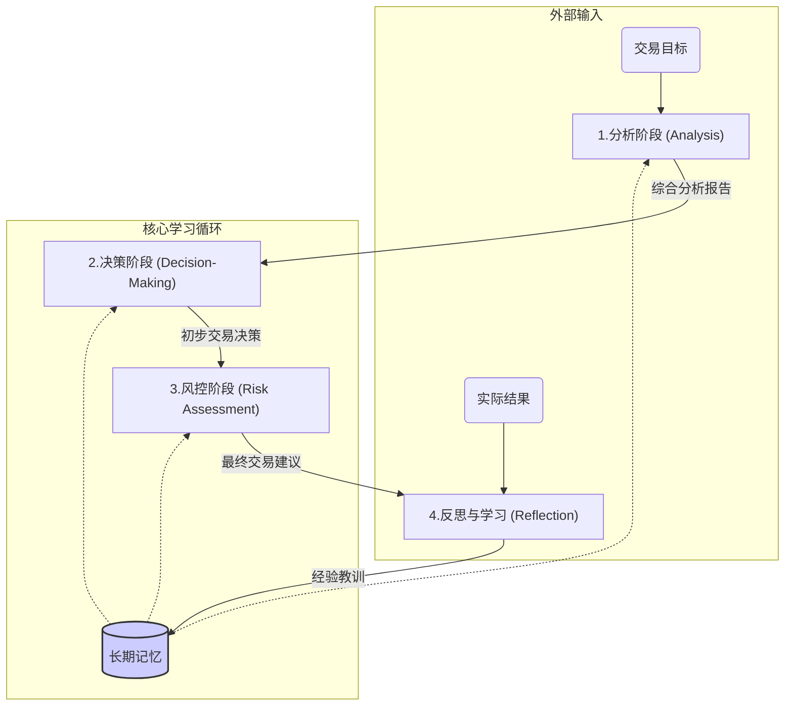

# Trading Agents

这是一个基于多智能体（Multi-Agent）的实验性框架，用于模拟金融市场的分析和交易决策过程。项目通过将复杂的决策流程分解给不同角色的 Agent，利用其协同工作、辩论和事后反思机制，来探索更稳健、更智能的交易策略。

## 核心特性

-   **多智能体架构**: 系统包含分析师、研究员、交易员、风险经理等多种 Agent，各司其职。
-   **辩论驱动决策**: 通过“看涨”与“看跌”研究员的对抗性辩论，以及风险偏好不同的辩手进行压力测试，提升决策的鲁棒性。
-   **闭环学习机制**: 交易完成后，系统会进行反思，总结经验教训并存入长期记忆，用于指导未来的决策，实现持续进化。
-   **模块化设计**: 各个 Agent 和工作流程都高度模块化，易于扩展和定制。

## 工作流程

项目的工作流被抽象为四个核心阶段和一个记忆模块，形成一个完整的学习闭环。



## 如何使用

### 1. 环境准备

-   **克隆项目**:
    ```bash
    git clone <your-repo-url>
    cd TradingAgents
    ```

-   **安装依赖**:
    建议在uv虚拟环境中安装
    ```bash
    uv sync
    ```

-   **设置环境变量**:
    在项目根目录创建一个 `.env` 文件，并填入必要的 API 密钥。  
    需要：
    1. FINNHUB_API_KEY  (https://finnhub.io/)
    2. 注册EXA 用于信息搜索 ([二选一](https://exa.ai/))
    ```
    # 
    FINNHUB_API_KEY=
    EXA_API_KEY=
    AWS_ACCESS_KEY_ID=
    AWS_SECRET_ACCESS_KEY=

    # 用于 LangFuse 追踪 (可选)
    LANGFUSE_PUBLIC_KEY="pk-lf-..."
    LANGFUSE_SECRET_KEY="sk-lf-..."
    LANGFUSE_HOST="https://cloud.langfuse.com"
    ```

### 2. 运行决策流

进入`strands_agents/`目录之后，可以直接运行 `run_descision.py` 脚本来启动一次完整的决策分析。

-   **运行命令**:
    ```bash
    uv run run_descision.py -c AMZN -d 2025-07-04
    ```

### 3. 查看结果

-   所有的分析报告、决策过程和最终建议都会被保存在 `results/` 目录下。
-   每个独立的运行任务会创建一个以 `公司名_日期` 命名的子目录，例如 `results/AMZN_2025-07-04/`。

### 4. 反思总结

-   **运行命令**:
    ```bash
    uv run run_reflection.py -c AMZN -d 2025-07-04 -o "Trade Result: +1% return over 1 weeks stock moved from 157.99 to 159.34. "
    ```

## 项目结构

```
/
├── agents/           # 定义所有 Agent 的角色和能力
├── graph/            # 编排 Agent 协作的核心工作流
├── dataflows/        # 处理外部数据源的工具 (如财经API)
├── tools/            # Agent 使用的通用工具 (如记忆模块)
├── results/          # 存放每次运行的输出结果
├── run_decision.py   # 运行决策流程的入口脚本
├── run_reflection.py # 运行反思流程的入口脚本
└── README.md         # 本文档
```